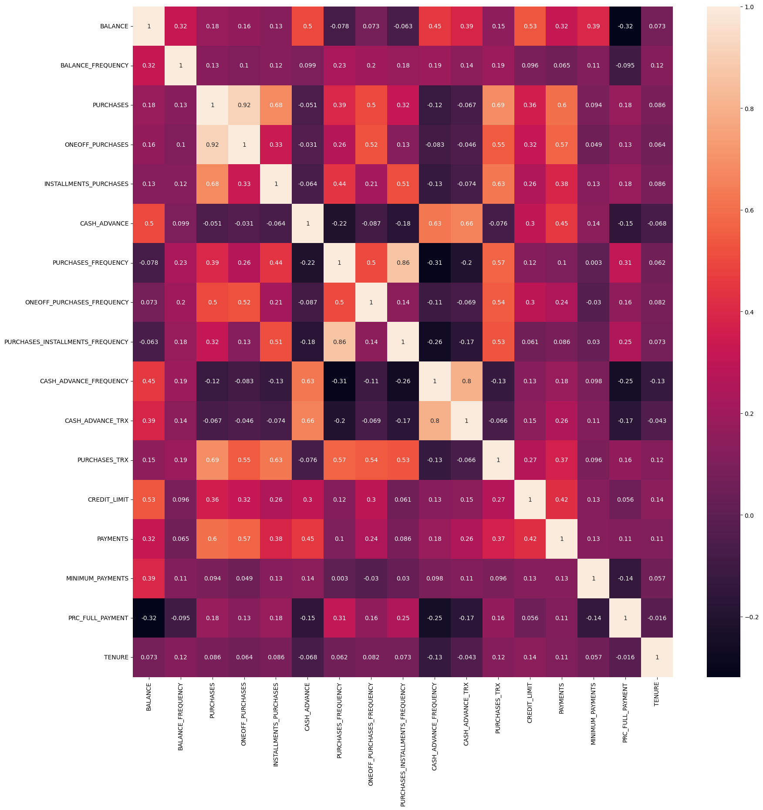
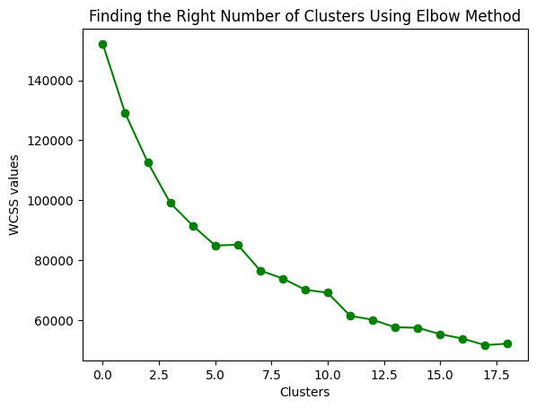
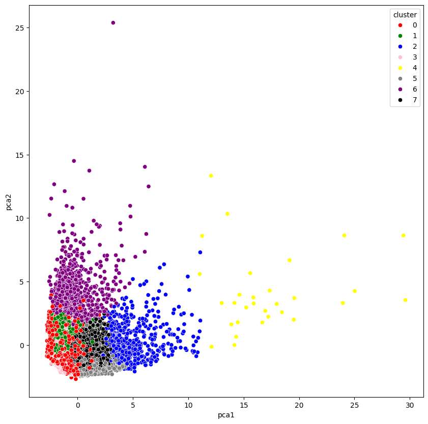

# Data-Driven Customer Segmentation for Strategic Marketing Insights

A project leveraging K-Means clustering, PCA, and autoencoders to segment customers based on transactional and behavioral data, enabling targeted marketing strategies for improved engagement and revenue.


## Introduction

Customer segmentation is critical for businesses to understand their customer base and tailor marketing strategies effectively. This project involves segmenting customers using behavioral and transactional data to create actionable clusters for marketing campaigns.


## Dataset
https://www.kaggle.com/datasets/arjunbhasin2013/ccdata
## Key Features

Transaction Data: Balance, purchases, cash advances, and payments.

Behavioral Attributes: Purchase frequency, installment purchases, and cash advance frequency.

Demographic Information: Tenure and credit limits.
## Models Used

K-Means Clustering:

    Groups customers into distinct clusters based on their attributes.

    Optimized using the Elbow Method to determine the number of clusters.

Principal Component Analysis (PCA):
    
    Reduced dimensionality for visualization and noise reduction.

Autoencoders:

    Used for dimensionality reduction, allowing more effective clustering in high-dimensional data.
# Methodology

## Exploratory Data Analysis (EDA)

1. Data Inspection:

    Reviewed customer features like balance, purchase behavior, and credit usage.
    
    Calculated statistical summaries and correlations.

2. Data Cleaning:

    Imputed missing values in Minimum Payments and Credit Limit.

    Removed irrelevant columns like CUST_ID.

3. Visualization:

    Histograms to explore distributions of key features.

    Correlation heatmaps to identify relationships among features.

## Clustering with K-Means

Feature Scaling:

    Applied StandardScaler to normalize features for clustering.

2. Optimal Clusters (Elbow Method):

    Evaluated within-cluster sum of squares (WCSS) to determine the optimal number of clusters (4 to 8).

3. Cluster Analysis:

    Segmented customers into actionable groups:

        Transactors: Low balance and cash advance usage.

        Revolvers: High balance and frequent cash advances.

        VIP Customers: High credit limit and full payment frequency.

        Low Tenure Customers: Recently joined with low activity.

## Dimensionality Reduction
1. Principal Component Analysis (PCA):

    Reduced data to two dimensions for visualizing cluster separation.

2. Autoencoders:

    Created compressed representations for clustering high-dimensional data.

## Evaluation and Insights

    Validated clustering quality using WCSS and cluster visualization.

    Gained actionable insights:

        VIP Customers: Target for premium offers and incentives.

        Revolvers: Focus on promoting cash advance offers.

        Low Tenure Customers: Develop campaigns to increase engagement


## Deployment

To clone this project run

```bash
git clone https://github.com/ekramul14/customer-segmentation-marketing-strategy.git  

cd customer-segmentation-marketing-strategy  

```


```


## Acknowledgements

    K-Means Clustering for grouping customers.
    PCA and Autoencoders for dimensionality reduction.
    Dataset from Kaggle.


## Screenshots





## 🔗 Links
[](https://mdtowsif1101.wixsite.com/my-site-1)
[](https://www.linkedin.com/in/ekramulhaque110/)

